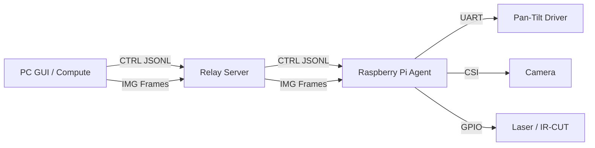

# DLC_system_model — OWPT Scheduling & Targeting Testbed

Optical Wireless Power Transmission(OWPT) 환경에서 **다수 수신부(Receiver)를 자동 탐지·조준하고, 스케줄링(예: Round-Robin)으로 순차 충전/조사하는 연구용 시스템**입니다.  
PC(GUI/연산) ↔ Relay Server ↔ Raspberry Pi(카메라/하드웨어 제어) 3-계층 구조로 구성되어 있습니다.


---

## 핵심 기능

- **Scanning (광역 탐색)**
  - Pan/Tilt 격자 스캔으로 작업 공간을 순회하며 이미지 수집
  - **LED ON/OFF 차분(Diff)** 기반으로 주변광 노이즈 억제 + 타겟 특징 강화
  - **Ultralytics YOLO** 추론(타일링 + NMS) 지원
  - 스캔 결과를 CSV로 로깅

- **Multi-Object Tracking (MOT)**
  - 스캔 중 검출된 객체에 **track_id**를 부여하여 동일 객체를 추적
  - HSV+Grayscale 히스토그램 특징 + 코사인 유사도 + 헝가리안 매칭(최적 매칭)
  - 스캔 종료 후 유사 track 병합 및 similarity log 저장

- **Pointing (정밀 조준)**
  - 스캔 CSV를 기반으로 타겟별 중심 도달 Pan/Tilt를 회귀로 추정
  - 레이저/타겟 오차 기반 피드백으로 정밀 조준(Closed-loop)

- **Scheduling (스케줄링 연구)**
  - 현재 구현: **Round-Robin**
    - (Phase A) 각 타겟을 “Adaptive aiming”으로 수렴
    - (Phase B) 타겟 ID를 순회하며 **dwell 시간**만큼 조사/충전
    - 주기적으로 **Battery check(LED 상태 프로브)** 수행 (ROI 기반 단일 프레임 판정)

---

## 시스템 아키텍처



---

## 폴더 구조

> **정리 기준:** “실행 진입점(entrypoint)” + “역할(PC/Server/Pi/Target)” 중심으로 구성

- `Com/` : **PC GUI 클라이언트**
  - `Com_main.py` : 메인 GUI (Scan / Test&Settings / Pointing / Scheduling 탭)
  - `scan_controller.py` : 스캔 세션, CSV export, YOLO+MOT 워커 스레드
  - `pointing_handler.py` : 스캔 CSV 분석 + 타겟별 조준 로직(믹스인)
  - `mot.py` : Multi-Object Tracking(트래킹/병합/유사도 로그)
  - `yolo_utils.py` : Ultralytics YOLO 로딩 + 타일링 추론 + NMS
  - `led_filter.py` : LED 색상(배터리 상태 등) 판정 유틸
  - `network.py` : GUI ↔ Server 통신(CTRL/IMG) + auto-reconnect
  - `ui_components.py`, `event_handlers.py`, `app_helpers.py` : UI/이벤트/보조 로직

- `Server/` : **Relay Server**
  - `Server_main.py` : PC ↔ Pi 사이의 headless 브로커(CTRL/IMG 채널 분리)

- `Raspberrypi/` : **Raspberry Pi Agent**
  - `Rasp_main.py` : 카메라(Picamera2), GPIO(레이저/IR-CUT), ESP32 UART 제어 + 스캔/스냅/프리뷰 스트리밍

- `Target/RX/` : **수신부(Receiver)**
  - 아두이노 펌웨어/회로/기구물 등 (배터리 모니터링 LED 등)

- `Experiments/` : 실험 코드/결과(스케줄링/성능 평가 등)
- `Docs/` : 문서/메모/캘리브레이션/설계 자료
- `3D_printer/` : 3D 프린팅 파트(STL/STEP 등)

- (루트) `yolov11*_diff.pt` : Diff 이미지용 YOLO 가중치 예시

---

## 빠른 실행 가이드

### 1) Relay Server 실행 (PC)

```bash
python3 Server/Server_main.py
```

- 기본 포트
  - Agent(Pi) CTRL/IMG: **7500 / 7501**
  - GUI(PC) CTRL/IMG: **7600 / 7601**

---

### 2) Raspberry Pi Agent 실행 (Raspberry Pi)

```bash
python3 Raspberrypi/Rasp_main.py
```

- 실행 시 서버 IP를 선택하도록 되어 있습니다.  
  필요하면 `Raspberrypi/Rasp_main.py`의 `SERVER_OPTIONS`를 수정하세요.

---

### 3) PC GUI 실행 (PC)

```bash
python3 Com/Com_main.py
```

- `Com/Com_main.py`의 `SERVER_HOST`가 기본 `"127.0.0.1"` 입니다.
  - Relay Server를 다른 PC에서 띄웠다면, **서버 IP로 변경**해야 합니다.

---

## 사용 흐름

### Scan
1. GUI의 **Scan 탭**에서 스캔 범위/스텝/카메라 설정/YOLO weights 등을 설정
2. `Start Scan`
3. 완료되면 `captures/scan_YYYYMMDD_HHMMSS/` 아래에 결과가 저장됩니다.

### Pointing
1. Scan 종료 후 자동으로 CSV를 기반으로 타겟 후보(track_id)를 계산
2. **Pointing 탭**에서 Target(ID) 선택 → `Move to Target` → `Start Aiming`

> UI 편의를 위해 최종 track_id는 1..N으로 재번호가 부여될 수 있습니다.

### Scheduling (Round-Robin)
1. **Scheduling 탭**에서
   - `Shoot Timer (s)` : 타겟당 조사/충전 dwell 시간
   - `Battery Check (s)` : LED 상태 프로브 주기
2. `RoundRobin` 실행 → Stop 누를 때까지 순회

---

## 데이터 출력

### 저장 위치
- 기본 저장 폴더: `Captures/`  
  (GUI 실행 위치 기준)

### CSV (스캔 결과)
스캔 세션 디렉토리에 다음 파일이 생성됩니다.

- `scan_*/scan_*_detections.csv`

컬럼(요약):
- `pan_deg`, `tilt_deg`
- `cx`, `cy`, `w`, `h` (bbox/center)
- `conf`, `cls`, `W`, `H`
- `track_id`
- `led_pred`, `led_*_score`, `led_roi_*`

### MOT 유사도 로그
- `scan_*/similarity_log_live.txt`  
  (매칭 후보/유사도/병합 결과 기록)


## License

MIT License (see `LICENSE`)
