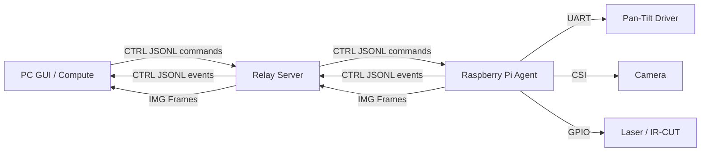

# DLC_system_model - OWPT Scheduling & Targeting Testbed

Optical Wireless Power Transmission(OWPT) 환경에서 **다수 수신부(Receiver)를 자동 탐지, 조준하고 스케줄링 알고리즘으로 순차 충전/조사하는 연구용 시스템**입니다.

전체 구성은 `PC GUI/Compute` ↔ `Relay Server` ↔ `Raspberry Pi Agent`의 3계층 구조입니다. PC는 GUI, YOLO/MOT, Pointing/Scheduling 로직을 담당하고, Raspberry Pi는 카메라, GPIO, Pan/Tilt 하드웨어 제어를 담당합니다.

---

## 핵심 기능

- **Scanning**
  - Pan/Tilt 격자 스캔으로 작업 공간을 순회하며 이미지 수집
  - LED ON/OFF 차분(Diff) 기반으로 주변광 노이즈 억제 및 타겟 특징 강화
  - Ultralytics YOLO 추론, 타일링, NMS 지원
  - 스캔 이미지, detection CSV, MOT 유사도 로그 저장

- **Multi-Object Tracking (MOT)**
  - 스캔 중 검출된 객체에 `track_id`를 부여하여 동일 객체 추적
  - HSV + Grayscale 히스토그램 특징, 코사인 유사도, 헝가리안 매칭 사용
  - 스캔 종료 후 유사 track 병합 및 similarity log 저장

- **Pointing**
  - 스캔 CSV를 기반으로 타겟별 중심 도달 Pan/Tilt 추정
  - 레이저/타겟 오차 기반 closed-loop adaptive aiming 지원
  - 최종 LED ROI와 battery state 추정값을 Scheduling 단계로 전달

- **Scheduling**
  - `RoundRobin`: 타겟 ID 순회, frame/slice 기반 균등 조사, 선택적 Battery Check
  - `Proposed`: Round-Robin 실행 순서를 유지하되, LED/battery coefficient 기반으로 frame 내 조사 시간을 동적 할당
  - Scheduling 시작 시 기존 타겟이 없으면 Scan → Pointing target 계산 → Adaptive aiming → 조사 루프로 진행

---

## 시스템 아키텍처


```mermaid
graph LR
    GUI[PC GUI / Compute] -->|CTRL JSONL commands| S[Relay Server]
    S -->|CTRL JSONL commands| PI[Raspberry Pi Agent]
    PI -->|CTRL JSONL events| S
    S -->|CTRL JSONL events| GUI
    PI -->|IMG Frames| S
    S -->|IMG Frames| GUI
    PI -->|UART| ESP32[Pan-Tilt Driver]
    PI -->|CSI| CAM[Camera]
    PI -->|GPIO| LASER[Laser / IR-CUT]
```

---

## 폴더 구조

- `Com/`: PC GUI 클라이언트 및 알고리즘 코드
  - `Com_main.py`: GUI 실행 진입점. 실제 구현은 `app/window.py`를 호출하는 compatibility wrapper입니다.
  - `app/`: 앱 설정, 상태, 메인 윈도우, 이벤트 처리, helper
  - `infra/`: 이벤트 버스, 이미지 라우팅, 네트워크 클라이언트, 프로토콜 상수/빌더
  - `ui/`: Tkinter 탭 UI와 preview frame
  - `vision/`: YOLO, MOT, scan controller, LED filter
  - `workflows/`: Scan, Pointing, Scheduling workflow 경계
  - `scheduling/`: `RoundRobinScheduler`, `ProposedScheduler`, 공통 scheduling interface
  - 루트의 `scan_controller.py`, `mot.py`, `network.py`, `pointing_handler.py` 등은 기존 import 호환용 wrapper입니다.
  - `tests/`: stdlib 기반 smoke/wrapper/unit tests

- `Server/`: Relay Server
  - `Server_main.py`: PC GUI와 Raspberry Pi Agent 사이의 headless 브로커
  - CTRL(JSONL) 채널과 IMG(frame) 채널을 분리해서 중계합니다.

- `Raspberrypi/`: Raspberry Pi Agent
  - `Rasp_main.py`: Picamera2, GPIO(레이저/IR-CUT), ESP32 UART 제어, scan/snap/preview 스트리밍

- `Target/RX/`: 수신부(Receiver)
  - `RX.ino`: 아두이노 펌웨어

- `Experiments/`: 탐지, 필터, MOT, beam/n modeling, simulation 등 실험 코드
- `Docs/`: 문서, 메모, 캘리브레이션, 설계 자료
- `3D_printer/`: 3D 프린팅 파트
- `Captures/`, `captures/`: 실행 중 생성되는 이미지/로그 저장 폴더
- 루트 `yolov11*_diff.pt`: Diff 이미지용 YOLO 가중치 예시

---

## 의존성

PC GUI/Compute 쪽 주요 패키지:

```bash
pip install opencv-python numpy scipy pillow ultralytics
```

Raspberry Pi Agent 쪽 주요 패키지:

```bash
pip install pyserial
```

Raspberry Pi에서는 `picamera2`, `RPi.GPIO`가 OS/배포판 환경에 맞게 설치되어 있어야 합니다. Linux에서 Tkinter가 빠져 있다면 별도 OS 패키지 설치가 필요할 수 있습니다.

---

## 빠른 실행 가이드

### 1. Relay Server 실행 (PC)

```bash
python Server/Server_main.py
```

기본 포트:

- Agent(Pi) CTRL/IMG: `7500 / 7501`
- GUI(PC) CTRL/IMG: `7600 / 7601`

### 2. Raspberry Pi Agent 실행 (Raspberry Pi)

```bash
python3 Raspberrypi/Rasp_main.py
```

실행 시 서버 IP를 선택합니다. 선택지 수정이 필요하면 `Raspberrypi/Rasp_main.py`의 `SERVER_OPTIONS`를 수정하세요.

### 3. PC GUI 실행 (PC)

```bash
python Com/Com_main.py
```

GUI의 기본 서버 주소는 `Com/app/config.py`의 `SERVER_HOST = "127.0.0.1"`입니다. Relay Server를 다른 PC에서 실행한다면 이 값을 서버 IP로 변경하세요.

---

## 사용 흐름

### Scan

1. GUI의 **Scan 탭**에서 스캔 범위, step, 카메라 설정, YOLO weights 등을 설정합니다.
2. `Start Scan`을 실행합니다.
3. 완료되면 `captures/scan_YYYYMMDD_HHMMSS/` 아래에 이미지와 결과 파일이 저장됩니다.

### Pointing

1. Scan 종료 후 CSV 기반으로 타겟 후보(`track_id`)를 계산합니다.
2. **Pointing 탭**에서 Target ID를 선택합니다.
3. `Move to Target` 후 `Start Aiming`으로 adaptive aiming을 수행합니다.

UI 편의를 위해 최종 target ID는 `1..N`으로 재번호가 부여될 수 있습니다.

### Scheduling

1. **Scheduling 탭**에서 frame/total 시간을 설정합니다.
   - `T_frame_sec (s)`: 한 frame의 전체 조사 시간
   - `T_total_sec (s)`: 전체 scheduling 목표 시간. 0이면 수동 중지 기준으로 동작합니다.
   - `Battery Check (s)`: RoundRobin battery check 간격
2. `RoundRobin` 또는 `Proposed`를 실행합니다.
3. 기존 타겟이 없으면 Scheduling이 Scan과 target 계산을 먼저 수행합니다.
4. 각 타겟에 대해 adaptive aiming을 수행한 뒤 frame 단위 조사 루프로 진입합니다.

---

## 데이터 출력

### 저장 위치

- Scan 기본 저장 폴더: `captures/`
- Pointing adaptive log 일부: `Captures/Pointing/`
- Server-side 저장은 `Server/Server_main.py`의 `SAVE_ON_SERVER = True`일 때만 `captures_server_*`에 생성됩니다.

### Scan CSV

YOLO 추론이 활성화된 scan session에는 다음 파일이 생성됩니다.

- `captures/scan_*/scan_*_detections.csv`

주요 컬럼:

- Pan/Tilt 및 bbox: `pan_deg`, `tilt_deg`, `cx`, `cy`, `w`, `h`, `W`, `H`
- Detection/MOT: `conf`, `cls`, `track_id`
- Scan 단계 LED 판정: `led_pred`, `led_bits`, `led_*_score`, `led_roi_*`
- 최종 Pointing/LED 정보: `final_pan_deg`, `final_tilt_deg`, `final_led_*`, `final_phase3_response_*`

### MOT 유사도 로그

- `captures/scan_*/similarity_log_live.txt`

매칭 후보, 유사도, 병합 결과가 기록됩니다.

---

## 테스트

저장소 루트에서 실행합니다.

```bash
uv run python -m compileall Com Server
uv run python -m unittest discover -s Com/tests
```

개별 테스트 파일만 실행할 수도 있습니다.

```bash
uv run python Com/tests/test_naming.py
uv run python Com/tests/test_router.py
uv run python Com/tests/test_scheduling_proposed.py
```

---

## License

MIT License. See `LICENSE`.
