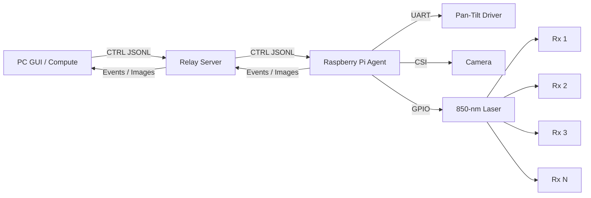

# Camera-Guided Multi-Receiver Optical Wireless Power Transfer Testbed

<p align="center">
  <b>Receiver Detection · Multi-Object Tracking · Laser Pointing · Charging Scheduling</b>
</p>

This repository presents a research testbed for **laser-based Optical Wireless Power Transfer (OWPT)** in a single-transmitter, multi-receiver environment.

The platform integrates:

- camera-based receiver detection,
- pan-tilt workspace scanning,
- multi-object tracking,
- laser pointing,
- receiver-state recognition,
- time-division charging,
- and adaptive charging scheduling.

The system was developed as an experimental platform for research on **multi-receiver OWPT scheduling for wireless sensor and IoT networks**.

---

# 1. Overview

In a single-transmitter multi-receiver OWPT system, a laser transmitter must sequentially deliver energy to multiple receivers.

Because the available charging time is limited, the scheduling policy determines how much charging time is allocated to each receiver.

The research conducted with this platform was developed in two stages.

### Stage 1 — Receiver-State-Based Scheduling

The receiver battery state is represented using a **3-bit LED combination**.

The transmitter detects the receiver position and LED state through a camera and allocates more charging time to receivers with lower energy states.

```text
Receiver Scanning
        ↓
Receiver Detection
        ↓
Receiver Identification
        ↓
Battery-State Recognition
        ↓
Laser Pointing
        ↓
Charging-Time Allocation
        ↓
Sequential Optical Power Transfer
```

### Stage 2 — Battery and Energy-Transfer-Efficiency-Based Scheduling

Battery state alone does not represent the actual OWPT receiving condition.

Received optical power can vary due to:

- Tx–Rx distance,
- laser beam spreading,
- pointing error,
- and other optical channel conditions.

Therefore, the scheduling algorithm was extended to jointly consider:

```text
Battery State
      +
Energy Transfer Efficiency
      ↓
Priority Score
      ↓
Adaptive Charging-Time Allocation
```

---

# 2. System Architecture

The experimental platform follows a three-layer architecture.


```mermaid
graph LR

    GUI["PC GUI / Compute"]
    SERVER["Relay Server"]
    PI["Raspberry Pi Agent"]
    DRIVER["Pan-Tilt Driver"]
    CAMERA["Camera"]
    LASER["850-nm Laser"]

    RX1["Rx 1"]
    RX2["Rx 2"]
    RX3["Rx 3"]
    RXN["Rx N"]

    GUI -->|CTRL JSONL| SERVER
    SERVER -->|CTRL JSONL| PI

    PI -->|Events / Images| SERVER
    SERVER -->|Events / Images| GUI

    PI -->|UART| DRIVER
    PI -->|CSI| CAMERA
    PI -->|GPIO| LASER

    LASER --> RX1
    LASER --> RX2
    LASER --> RX3
    LASER --> RXN
```

The **PC** performs computational tasks including:

- image processing,
- YOLO inference,
- multi-object tracking,
- target position estimation,
- pointing control,
- and scheduling.

The **Raspberry Pi** controls:

- the camera,
- pan-tilt hardware,
- laser,
- IR-CUT module,
- and communication with the PC.

---

# 3. Experimental OWPT Testbed

<p align="center">
  
</p>

> `assets/testbed_overview.png`  
> Recommended image: experimental environment and Tx/Rx layout from the OWPT scheduling experiment.

The experimental OWPT system consists of:

### Transmitter

- laser power-transfer module,
- pan-tilt camera platform,
- camera,
- control unit,
- Raspberry Pi,
- and pointing controller.

### Receiver

Each receiver contains:

- photovoltaic cell,
- battery,
- retroreflective marker,
- battery-state LED module,
- and receiver electronics.

The transmitter identifies the position and state of each receiver using the camera and sequentially transfers optical power using time-division charging.

---

# 4. Receiver Scanning

The pan-tilt platform scans the target area using a predefined angular grid.

For each pan-tilt position, the system captures:

```text
LED ON Image
LED OFF Image
```

and calculates:

```text
Diff = |Image_ON - Image_OFF|
```

Differential imaging suppresses static background components and enhances receiver-related optical features.

The resulting image is processed by the receiver-detection algorithm.

---

# 5. Receiver Detection

Receiver candidates are detected using an **Ultralytics YOLO** model.

The current implementation supports:

- full-image inference,
- tiled inference,
- overlapping tiles,
- confidence filtering,
- Non-Maximum Suppression,
- and GPU acceleration when available.

The detection results contain:

```text
Bounding Box
Confidence
Class
Image Coordinate
Pan Angle
Tilt Angle
```

---

# 6. Multi-Object Tracking

A physical receiver may appear in multiple neighboring scan images.

Therefore, detections obtained from different pan-tilt positions must be associated with the same receiver.

The tracking module uses:

- HSV histogram features,
- grayscale histogram features,
- spatial grid-based feature extraction,
- cosine similarity,
- neighboring scan-frame candidates,
- and Hungarian assignment.

Each identified receiver is assigned a persistent:

```text
track_id
```

Similar tracks can also be merged after the scanning stage.

---

# 7. Target Position Estimation

After scanning, the detected image coordinates are mapped to pan and tilt angles.

For horizontal motion:

```text
cx = a · pan + b
```

For vertical motion:

```text
cy = e · tilt + f
```

where:

- `cx`, `cy` denote receiver image coordinates,
- `pan`, `tilt` denote transmitter angles.

The angle at which the receiver reaches the image center is estimated from the fitted relationships.

```text
Scan Detections
      ↓
Pixel-Angle Relationship
      ↓
Pan / Tilt Estimation
      ↓
Initial Target Point
```

This provides the coarse pointing position for each receiver.

---

# 8. Closed-Loop Laser Fine Pointing

After coarse pointing, the system performs closed-loop laser alignment.

The camera detects:

```text
Receiver Target Position
          +
Laser Spot Position
```

The pixel-domain error is calculated as:

```text
error_x = target_x - laser_x

error_y = target_y - laser_y
```

The error is converted into an angular correction:

```text
Δpan  = K_pan  × error_x

Δtilt = K_tilt × error_y
```

The process is repeated until the pointing error falls below the defined convergence threshold.

```text
Capture
   ↓
Detect Receiver
   ↓
Detect Laser
   ↓
Calculate Error
   ↓
Pan/Tilt Correction
   ↓
Repeat
```

<p align="center">
  
</p>

> Recommended image: pointing debug result showing the detected target, laser position, and pointing error.

---

# 9. Receiver-State Representation

Each receiver represents its battery state using three LEDs.

The LED states correspond to a 3-bit value:

```text
R B G
```

where:

```text
ON  = 1
OFF = 0
```

Therefore, eight discrete receiver states can be represented:

```text
000
001
010
011
100
101
110
111
```

with:

```text
000 → lowest state

111 → highest state
```

The transmitter identifies the LED combination using its camera.

---

# 10. Scheduling Methods

## 10.1 Round-Robin Scheduling

The conventional Round-Robin scheduler allocates the same charging time to every receiver.

For:

```text
N       = number of receivers
T_frame = scheduling-frame duration
```

the charging duration is:

```text
t_i = T_frame / N
```

Thus:

```text
Rx1 → Rx2 → Rx3 → ... → RxN
```

receives equal temporal access to the laser transmitter.

---

## 10.2 Receiver-State-Based Scheduling

The first proposed method allocates charging time according to the receiver state.

Let:

```text
d_i(k) ∈ {0, ..., 7}
```

represent the receiver's 3-bit state.

The charging coefficient is:

```text
b_i(k) = (8 - d_i(k)) / 8
```

A receiver with a lower state therefore obtains a larger charging coefficient.

The charging time is allocated as:

```text
               b_i(k-1)
t_i(k) = --------------------- × T_frame
          Σ b_j(k-1)
```

Thus:

```text
Lower receiver state
        ↓
Larger coefficient
        ↓
Longer charging duration
```

---

# 11. Experimental Evaluation of Receiver-State-Based Scheduling

The indoor experiment used four receivers.

| Parameter | Value |
|---|---:|
| Number of receivers | 4 |
| Tx–Rx distance | 4.5–6.0 m |
| Number of frames | 8 |
| Frame duration | 240 s |
| Initial states | 100 / 101 / 110 / 101 |

For Round-Robin:

```text
Rx1 = 60 s
Rx2 = 60 s
Rx3 = 60 s
Rx4 = 60 s
```

For the proposed scheduler:

```text
Rx1 = 80 s
Rx2 = 60 s
Rx3 = 40 s
Rx4 = 60 s
```

The lowest-state receiver therefore receives the longest charging duration.

---

## Battery-Voltage Experiment

<p align="center">
  
</p>

> Recommended image: normalized battery-voltage trajectories from the multi-receiver scheduling experiment.

The most significant difference was observed for **Rx1**, which had the lowest initial receiver state.

Approximate voltage change:

| Receiver | Round-Robin | Proposed |
|---|---:|---:|
| Rx1 | −5 mV | **+5 mV** |
| Rx2 | Similar trend | Similar trend |
| Rx3 | −5 mV | −10 mV |
| Rx4 | Similar trend | Similar trend |

Rx1 shows an approximately **10 mV difference** between the two scheduling strategies.

The proposed scheduler does not attempt to maximize the voltage of every receiver.

Instead, it redistributes the limited charging time to protect receivers with relatively low energy states and reduce imbalance among receivers.

---

# 12. Image-Based Energy Transfer Efficiency Model

The second research stage considers that charging efficiency differs between receivers even when their battery states are identical.

To estimate the energy-transfer condition, laser ON/OFF images are used.

The laser intensity distribution is modeled as an elliptical Gaussian beam:

```text
                      (u-u0)^2   (v-v0)^2
s(u,v) = exp[-2( ---------------- + ---------------- )]
                         wu^2         wv^2
```

Experimentally estimated mean beam radii:

```text
w_u = 118.14 px

w_v = 124.51 px
```

<p align="center">
  
</p>

The laser intensity incident on the PV-cell area can then be estimated from the camera image.

---

# 13. Regression-Based Received-Power Estimation

A regression model is used to estimate the relationship between image-based optical intensity and measured PV output voltage.

The adopted shifted quadratic model is:

```text
V_i = a(x_i - b)^2 + c
```

where:

- `x_i` is the image-based intensity value,
- `V_i` is the predicted PV voltage.

The fitted coefficients used in the study were approximately:

```text
a = 1.51
b = 0.01
c = 0.03
```

The predicted charging power is then calculated using the estimated voltage.

---

# 14. Battery and Energy-Transfer-Efficiency-Based Scheduling

The second proposed scheduler combines two factors:

```text
Battery State        → B_i

Transfer Efficiency  → C_i
```

The charging-efficiency coefficient is calculated from the inverse predicted charging power:

```text
          1 / P_i
C_i = ----------------
       Σ (1 / P_j)
```

The scheduling priority becomes:

```text
Score_i(k) = B_i(k-1) × C_i
```

and the charging duration is:

```text
                 Score_i(k)
t_i(k) = ----------------------------- × T_frame
           Σ Score_j(k)
```

Consequently, a receiver receives higher priority when it has:

```text
Low Battery State
        +
Low Energy Transfer Efficiency
```

This allows the scheduler to account not only for energy deficiency but also for differences in the actual optical receiving environment.

---

# 15. Simulation Results

The scheduling methods were compared using **First Node Death (FND)** as the network-lifetime metric.

FND is defined as the time at which the battery level of the first sensor node falls below the predefined threshold.

### Simulation Parameters

| Parameter | Value |
|---|---:|
| Number of sensor nodes | 4 |
| Monte-Carlo trials | 100 |
| Tx–Rx distance | 5–10 m |
| Battery capacity | 12960 J |
| FND threshold | 12.5% |
| Frame duration | 240 s |
| Node power consumption | 50 mW |

---

## Average First Node Death Time

<p align="center">
  
</p>

| Scheduling Method | Average FND |
|---|---:|
| No Charging | 3780 min |
| Round-Robin | 5286 min |
| Receiver-State-Based | 5352 min |
| **Battery + Transfer-Efficiency Proposed** | **5553 min** |

The proposed method achieved the longest average network lifetime.

Relative improvement:

```text
vs. No Charging
+46.9%

vs. Round-Robin
+5.1%

vs. Receiver-State-Based Scheduling
+3.8%
```

This result shows that incorporating the actual energy-transfer condition into scheduling can improve network lifetime beyond a scheduler based only on receiver state.

---

# 16. Research Progression

The overall research progression implemented in this repository can be summarized as:

```text
Equal Charging
Round-Robin
      ↓
Receiver-State Recognition
      ↓
Receiver-State-Based Scheduling
      ↓
Image-Based Beam Modeling
      ↓
Energy Transfer Efficiency Estimation
      ↓
Battery + Efficiency Scheduling
```

The system therefore evolved from a simple time-division OWPT testbed into a camera-guided scheduling platform capable of considering both:

```text
Receiver Energy State
           +
Physical OWPT Transfer Condition
```

---

# 17. Repository Structure

```text
.
├── Com/
│   ├── Com_main.py
│   ├── app/
│   ├── infra/
│   ├── ui/
│   ├── vision/
│   ├── workflows/
│   ├── scheduling/
│   └── tests/
│
├── Server/
│   └── Server_main.py
│
├── Raspberrypi/
│   └── Rasp_main.py
│
├── Target/
│   └── RX/
│       └── RX.ino
│
├── Experiments/
│   ├── detection/
│   ├── tracking/
│   ├── pointing/
│   ├── beam_model/
│   └── scheduling/
│
├── Docs/
│   ├── system_architecture.md
│   ├── hardware_setup.md
│   └── experiment_setup.md
│
├── assets/
│   ├── testbed_overview.png
│   ├── pointing_result.png
│   └── results/
│       ├── battery_voltage_comparison.png
│       ├── beam_intensity_model.png
│       └── fnd_comparison.png
│
├── requirements.txt
├── LICENSE
└── README.md
```

---

# 18. Main Software Modules

| Module | Function |
|---|---|
| PC GUI | System control and experiment interface |
| YOLO Detector | Receiver detection |
| MOT | Receiver identification across scan positions |
| Scan Controller | Pan-tilt scan and image processing |
| Pointing | Target-angle estimation |
| Fine Aiming | Closed-loop laser alignment |
| Scheduling | Multi-receiver charging control |
| Relay Server | PC–Raspberry Pi communication |
| Raspberry Pi Agent | Physical hardware control |

---

# 19. Requirements

## PC

```bash
pip install numpy scipy opencv-python pillow ultralytics
```

Additional packages may be required depending on the experiment configuration.

---

## Raspberry Pi

```bash
pip install pyserial
```

The Raspberry Pi environment must also provide:

```text
picamera2
RPi.GPIO
```

---

# 20. Quick Start

## Step 1 — Start Relay Server

```bash
python Server/Server_main.py
```

Default ports:

| Connection | Port |
|---|---:|
| Raspberry Pi Control | 7500 |
| Raspberry Pi Images | 7501 |
| GUI Control | 7600 |
| GUI Images | 7601 |

---

## Step 2 — Start Raspberry Pi Agent

```bash
python3 Raspberrypi/Rasp_main.py
```

---

## Step 3 — Start PC GUI

```bash
python Com/Com_main.py
```

The GUI provides interfaces for:

- scanning,
- preview,
- manual pan-tilt control,
- laser control,
- pointing,
- and scheduling.

---

# 21. Experimental Output

A scan session produces:

```text
captures/
└── scan_YYYYMMDD_HHMMSS/
    ├── captured images
    ├── scan_*_detections.csv
    └── similarity_log_live.txt
```

Typical detection data include:

```text
pan_deg
tilt_deg
cx
cy
w
h
conf
cls
track_id
```

Additional fields may contain:

- LED-state estimates,
- receiver-state information,
- final pointing coordinates,
- and other experimental measurements.

---

# 22. Publications

## Battery-Aware Scheduling for Multi-Receiver Laser Wireless Power Transfer in IoT Systems

**H. J. Lee, S. M. Kim, and J. Kim**

International Conference on Ubiquitous and Future Networks (**ICUFN**), 2026.

Main contributions:

- 3-bit LED representation of receiver battery state,
- camera-based receiver-state recognition,
- receiver-state-dependent charging-time allocation,
- experimental comparison with Round-Robin scheduling,
- and validation using a real indoor laser-based OWPT testbed.

---

## Battery and Energy Transfer Efficiency Based Laser Wireless Power Transfer Scheduling for Wireless Sensor Networks

**H. J. Lee, S. M. Kim, and J. Kim**

2026.

Main contributions:

- image-based laser intensity estimation,
- Gaussian beam modeling,
- regression-based PV voltage estimation,
- energy-transfer-efficiency-aware scheduling,
- and network-lifetime evaluation using First Node Death.

---

# 23. Key Research Contributions

This project demonstrates an integrated framework for:

1. **camera-guided detection of multiple optical-power receivers,**
2. **receiver identification during pan-tilt scanning,**
3. **automatic laser pointing,**
4. **visual receiver-state recognition,**
5. **adaptive time-division optical power scheduling,**
6. **image-based estimation of OWPT energy-transfer conditions,**
7. **and lifetime-oriented scheduling for wireless sensor networks.**

---

# 24. Future Work

Possible extensions include:

- dynamic receiver tracking,
- mobile receiver charging,
- UAV optical wireless power transfer,
- receiver-side PV orientation control,
- simultaneous lightwave information and power transfer,
- and learning-based transmitter / receiver control.

---

# License

This project is released under the MIT License.

See `LICENSE` for details.